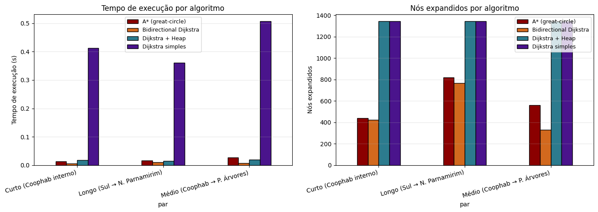
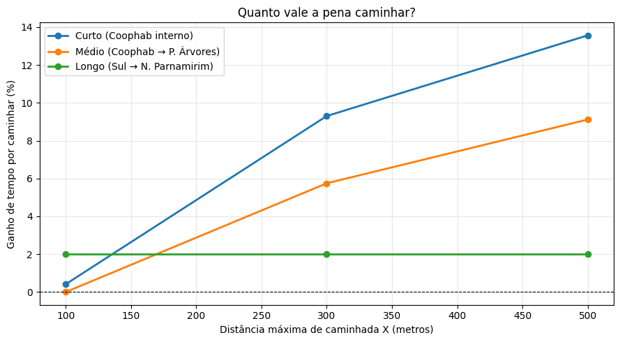
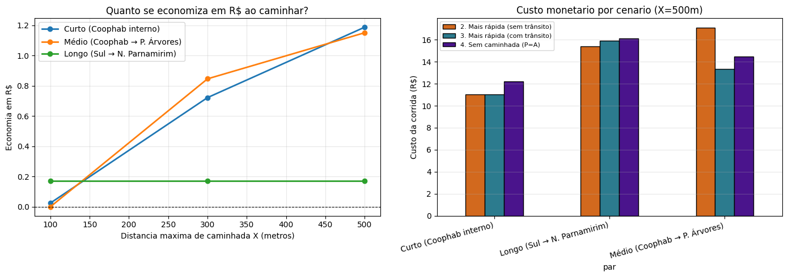

# RideSmart — Modelagem e Análise de Rotas Urbanas com Grafos

**Projeto Final — Algoritmos e Estrutura de Dados II (DCA3702)**
**Universidade Federal do Rio Grande do Norte (UFRN) — 2026.1**
**Professor:** Ivanovitch Silva

**Autores:** Matheus Fernandes e Thales Varela

📄 **Relatório completo (4 páginas, formato IEEE):** [`relatorio.pdf`](relatorio.pdf)

---

## 1. Visão Geral

Simulação de aplicativo de mobilidade urbana ("RideSmart") que, dado:
- ponto de origem **A**,
- ponto de destino **B**, e
- distância máxima de caminhada **X**,

decide o **melhor ponto de embarque P** considerando o trade-off entre caminhar mais e chegar mais rápido (em tempo e em dinheiro).

```
A ──(caminhada ≤ X metros)──> P ──(carro)──> B
```

---

## 2. Região Analisada

Coophab e Cajupiranga (Parnamirim/RN), centradas em **(-5.908906, -35.205872)** com raio de 3 km. Mesma região do trabalho da Unidade 2, escolhida por **continuidade analítica**. A topologia já foi caracterizada estruturalmente (1342 nós, 1936 arestas após conversão para grafo simples, k-core máximo = 2, bridge node `3454188414` identificado na Av. Olavo Montenegro).

---

## 3. Os 5 Cenários Comparados

| # | Cenário | Função de custo |
|---|---|---|
| 1 | Menor distância | `length` |
| 2 | Mais rápida sem trânsito | `travel_time` |
| 3 | Mais rápida com trânsito | `travel_time_traffic` |
| 4 | Sem caminhada (P = A) | `travel_time_traffic` |
| 5 | Ganho por caminhar | comparação #4 vs #3 |

---

## 4. Os 4 Algoritmos Implementados (do zero)

| # | Algoritmo | Complexidade | Implementação |
|---|---|---|---|
| 1 | Dijkstra simples | O(V² + E) | Busca linear pelo mínimo |
| 2 | Dijkstra + Min-Heap | O((V + E) · log V) | Priority queue própria |
| 3 | A* (great-circle) | O((V + E) · log V) | Heurística geográfica admissível |
| 4 | Dijkstra Bidirecional | O((V + E) · log V) | Algoritmo adicional da literatura |

Todos validados contra `nx.shortest_path_length` do NetworkX em pares aleatórios: coincidência exata com erro inferior a 0,01m.

---

## 5. Modelo de Trânsito Sintético

```
travel_time_traffic = travel_time_base × multiplicador_tipo × ruído_aleatório
```

| Parâmetro | Valor |
|---|---|
| Multiplicador `primary` (Olavo Montenegro) | **4.0** |
| Multiplicador `secondary` | 2.8 |
| Multiplicador `residential` | 1.3 |
| Ruído aleatório | uniform(0.9, 2.2) com seed=42 |
| Fator médio resultante | **2.62×** (cauda até 9× em vias arteriais) |

---

## 6. Modelo Monetário

Baseado em tarifas reais de Uber/99 no Brasil:

```
custo = (R$ 2,50 + km × R$ 2,00) × surge
```

| Parâmetro | Valor |
|---|---|
| Tarifa base (bandeirada) | R$ 2,50 |
| Preço por km | R$ 2,00 |
| Surge (com trânsito) | × 1,5 |

---

## 7. Modelo de Tempo de Busca do Motorista (Insight Central)

Caminhar acontece **em paralelo** ao tempo de busca do motorista. Portanto, caminhar é efetivamente "grátis" enquanto for mais rápido que a espera do Uber:

```
t_efetivo = max(0, t_caminhada − UBER_FETCH_TIME)
```

Com `UBER_FETCH_TIME = 300s` (5 min), caminhar até **~417m é gratuito**: o usuário estaria parado esperando o motorista de qualquer forma. Esse modelo é o que torna a otimização do RideSmart útil na prática (sem ele, o otimizador degenera para sempre escolher `P = A`).

---

## 8. Configuração Experimental

- **3 pares A→B**:
  - Curto (Coophab interno): 2229m em linha reta
  - Médio (Coophab → P. Árvores): 1449m
  - Longo (Sul → N. Parnamirim): 3209m, cruzando a Av. Olavo Montenegro
- **3 valores de X**: 100m, 300m, 500m
- **Total: 9 configurações × 5 cenários = 45 execuções**

---

## 9. Principais Resultados

### Eficiência dos Algoritmos



| Algoritmo | Tempo médio | Nós expandidos |
|---|---|---|
| Dijkstra simples | ~0,4 s | 1342 (sempre) |
| Dijkstra + Heap | ~0,02 s (**25× mais rápido**) | 1342 |
| A* (great-circle) | ~0,02 s | 230–820 (40–70% menos) |
| Bidirectional | ~0,01 s | 330–770 (competitivo com A*) |

### Ganho de Caminhar (Tempo)



| Par | X=500m: ganho tempo |
|---|---|
| Curto (Coophab interno) | **13,6% (75 s)** |
| Médio (Coophab → P. Árvores) | **9,1% (67 s)** |
| Longo (Sul → N. Parnamirim) | ~2% — saturação topológica em 56m |

### Economia Monetária



| Par | X=500m: economia |
|---|---|
| Curto | **R$ 1,19** |
| Médio | **R$ 1,15** |
| Longo | R$ 0,17 (saturado) |

---

## 10. Achados Não-Óbvios

1. **Trade-off tempo × dinheiro**: no par Médio, a rota mais rápida sem trânsito custa **R$ 17,10**, mais cara que a rota com trânsito (R$ 13,65). A rota livre é mais longa em quilômetros; sob congestionamento, o algoritmo prefere uma rota mais curta em km que economiza dinheiro.

2. **Saturação topológica no par Longo**: caminhar mais de 56m não traz benefício adicional, pois todos os candidatos `P` convergem para o mesmo ponto de travessia da Av. Olavo Montenegro. **Conexão direta com o bridge node `3454188414`** identificado via betweenness centrality no T1U2.

3. **Bidirectional ≥ A***: em pares onde o A* não encontra uma direção clara (par Médio), o Bidirectional expande **330 nós** vs **559** do A*, mostrando que um algoritmo sem heurística pode superar uma busca guiada quando a heurística é fraca.

---

## 11. Estrutura do Repositório

```
projeto_final_AED2/
├── README.md                       ← este arquivo
├── PROJETO_FINAL.ipynb             ← notebook executável (Google Colab)
├── relatorio.pdf                   ← relatório IEEE 4 páginas
└── imagens/
    ├── trafego_sintetico.png       ← modelo de trânsito (Fig. 1)
    ├── comparacao_algoritmos.png   ← eficiência dos algoritmos (Fig. 2)
    ├── rotas_par_medio.png         ← rotas do par Médio (Fig. 3)
    ├── rotas_par_curto.png         ← rotas do par Curto
    ├── rotas_par_longo.png         ← rotas do par Longo
    ├── ganho_tempo.png             ← ganho de caminhar em tempo (Fig. 4)
    └── economia_dinheiro.png       ← economia em R$ (Fig. 5)
```

---

## 12. Como Reproduzir

1. Abra `PROJETO_FINAL.ipynb` no [Google Colab](https://colab.research.google.com).
2. Execute todas as células em ordem (`Runtime → Run all`).
3. O notebook é autocontido — instala `osmnx` automaticamente e baixa a malha viária do OpenStreetMap em tempo real.
4. Tempo estimado de execução completa: **~3–5 minutos**.
5. Todas as imagens são regeradas automaticamente em `imagens/`.

---

## 13. Apresentação Demo Section

Data: **29/06/2026 ou 01/07/2026** (presencial).

---

## 14. Conexão com a Unidade 2

Este projeto reaproveita a malha viária estudada no [trabalho da Unidade 2](../projeto_T1U2_AED2/) (T1U2), onde caracterizamos a topologia da rede usando degree, betweenness, closeness e k-core. O **bridge node `3454188414`** identificado lá reaparece neste trabalho como **ponto crítico de saturação topológica** no par Longo, uma validação cruzada interessante entre as duas análises.

---

## 15. Referências

- Dijkstra, E. W. (1959). *A note on two problems in connexion with graphs*. Numerische Mathematik.
- Hart, P. E., Nilsson, N. J., & Raphael, B. (1968). *A Formal Basis for the Heuristic Determination of Minimum Cost Paths*. IEEE TSSC.
- Boeing, G. (2017). *OSMnx: New methods for acquiring, constructing, analyzing, and visualizing complex street networks*. Computers, Environment and Urban Systems.
- Geisberger, R., Sanders, P., Schultes, D., & Delling, D. (2008). *Contraction Hierarchies: Faster and Simpler Hierarchical Routing in Road Networks*. WEA.
- Material da disciplina DCA3702 — Prof. Ivanovitch Silva.
